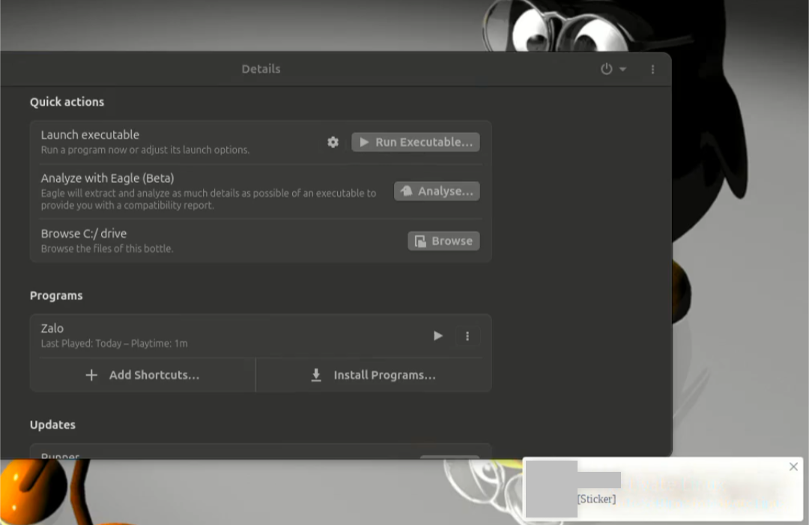

# Zalo for Linux (Call Experiment)

## 🎯 Giới thiệu
Thử nghiệm chạy Zalo Windows port trên Linux qua Bottles + Caffe runner.  
Mục tiêu: chứng minh có thể **nhắn tin + gọi thoại (mic)** trên Linux.  

## ✅ Tính năng hoạt động
- Font hiển thị chuẩn
- Nhắn tin gửi/nhận OK
- Fast startup
- Mic hoạt động trong call
- Nhận/gửi call ổn định

## ❌ Vấn đề còn tồn tại
- Paste (clipboard) chưa hoạt động
- Camera chưa bật được trong call
- Ngốn tài nguyên (CrRendererMain)

## 🛠️ Môi trường thử nghiệm
- Ubuntu LTS 24.04 (HP ProBook 4540s)

## 📌 Hướng dẫn cơ bản
1.  Cài v4laloopback for camera
   - Với Ubuntu/Debian: sudo apt install v4l2loopback-dkms v4l2loopback-utils
   - Với Arch/Manjaro: sudo pacman -S v4l2loopback-dkms
   - Load module bằng cách: sudo modprobe v4l2loopback
   - Kiểm tra camera ảo: /ls /dev/video*
3. Cài Bottles trên Linux.
4. Tạo runner (Caffe runner).
5. Cài thêm allfont, unifont, vcredist2019 (optional), dotnet48, ffdshow trong Details >> Dependencies
6. Chạy `ZaloSetup.exe`
7. Login nhưng phần QR hơi ức chế vì nó dễ failed. Nên kiên trì

## ⚠️ Lưu ý
- Đây là bản thử nghiệm, không chính thức.
- Repo chỉ chia sẻ kinh nghiệm, không đảm bảo chạy trên mọi distro/máy.
- Ai muốn tối ưu thêm (clipboard, camera, resource) thì welcome đóng góp.

## 🤝 Đóng góp
Pull request, issue, hoặc chia sẻ kinh nghiệm thêm đều được hoan nghênh.

- Một vài preview -

